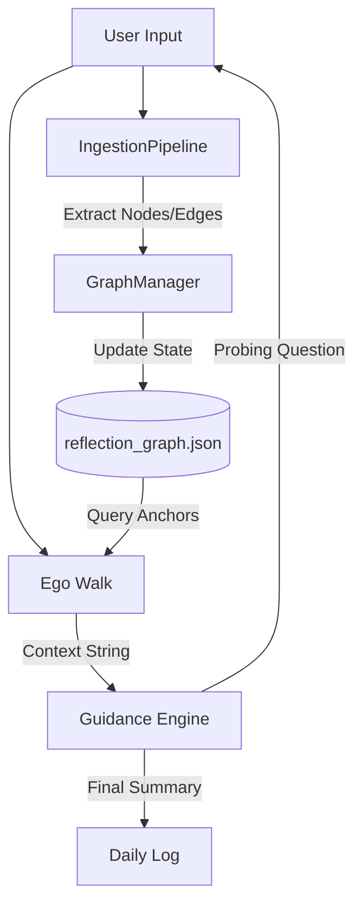
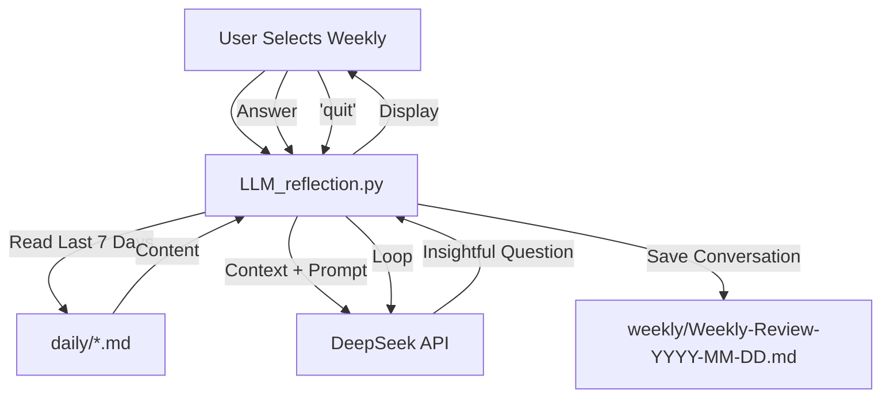

# Codemap: Reflections Data Flows (auto-maintained by LLM)
Last updated: 2025-11-20
Responsibility: Major data / request / event flows through the system

## 1. Graph-Enhanced Cognitive Cycle (Daily Reflection)

## 2. Weekly Review Flow

